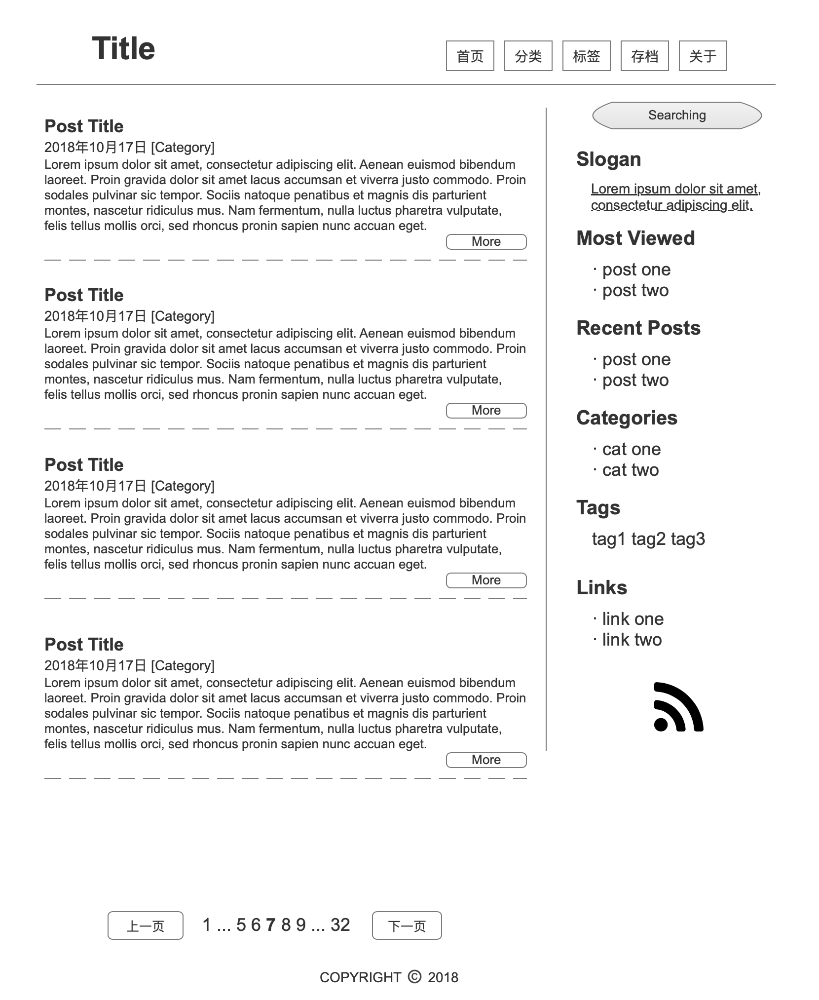

# blog.jase.im_v0.1
My first personal blog-site using Django framework

我的第一个博客采用常规的布局, 布局大致如下.

Home page:

博客详情页增加评论功能

TODO:

-   [ ] 服务器部署脚本
-   [x] 注册功能
-   [x] 用户可以修改自己的资料
-   [x] 注册用户可以在发布和修改文章
-   [x] 可以查看别的用户的公开资料
-   [ ] 搜索匹配位置高亮显示
-   [ ] 根据访问者IP(每天一个IP计算一次)更新页面查看人数, 新增网站访问人数显示 
-   [ ] 分页显示优化
-   [ ] 文章内MD文章TOC显示优化
-   [ ] 根据来访者IP统计访问者地图