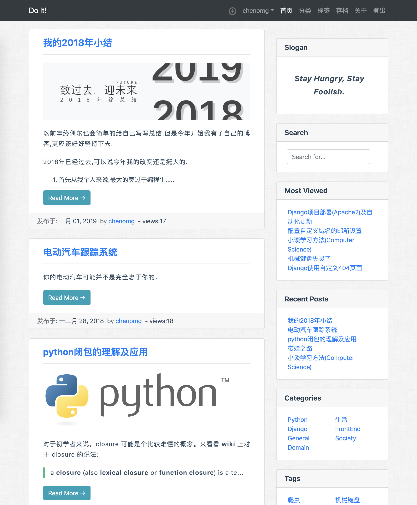

# blog.jase.im_v0.1
My first personal blog-site using Django framework

我的第一个博客采用常规的布局, 截图如下.

Home page:

博客详情页增加评论功能

TODO:

-   [x] 服务器部署脚本
-   [x] 注册功能
-   [x] 用户可以修改自己的资料
-   [x] 注册用户可以在发布和修改文章
-   [x] 可以查看别的用户的公开资料
-   [x] 网站使用Google analytics分析来访者信息
-   [ ] ~~搜索匹配位置高亮显示~~
-   [x] 分页显示优化
-   [x] 文章内MD文章TOC显示优化
-   [x] 项目代码注释更新
-   [x] 项目总结文档
-   [ ] 数据库备份
-   [x] 未完成编辑的文章可以选择保存为草稿, 待编辑完毕后再发布
-   [x] 文章编辑页面新增一个应用按钮(保存后不跳转)
-   [ ] 文章仅保存(不发布)时,保存按钮动作使用ajax实现
-   [ ] 文章编辑时每隔一定时间自动保存草稿
-   [ ] 网站后台监控界面